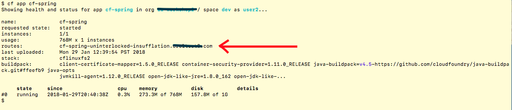

## Workshop 

### Setup 
  * Download and install Cloud Foundry CLI from [Github CLI repository](https://github.com/cloudfoundry/cli#downloads)
  * Verify CLI is running 
  ```bash
   $ cf --version 
  ```
  * Get your `API server URL`, `username` and `password` from the lab organizer 

#### Goal  
Deploy a sample spring app to Cloud Foundry running on Oracle Cloud Infrastucture using `cf` client.

#### Exercise 1 -- Deploy cf-spring app

#### Steps

##### Login 
* Target the API server 
```
  $ cf api --skip-ssl-validation  <API server URL>
```
* Login 

```
  $ cf login -u <username> -p <password>
```
* Verify targeted to an org
```bash
 $ cf target
```

##### Download and Deploy a sample application
* Download 
```bash
 $ git clone https://github.com/cloudfoundry-samples/cf-sample-app-spring
```
* Deploy
```bash
 $ cd cf-sample-app-spring
 $ cf push
```

##### Find application URI and connect to it
* Get list of deployed applications
````bash
 $ cf apps
````
* Show details about the `cf-spring` application deployed in the previous step
```bash
$ cf app cf-spring
```
* Find application URI



* Launch browser and connect to that URI


#### Exercise 2 -- Scale the application horizontally

#### Steps

##### Scale 

* Use your favorite editor to edit `manifest.yml` and the change the number of `instances` to deploy. Change 

```yaml
applications:
- name: cf-spring
  ...
  instances: 1
  ...
```

to 

```yaml
applications:
- name: cf-spring
  ... 
  instances: 3
  ...
```

* Redeploy the application
```bash 
$ cf push 
```

* Verify the number of instances running
```bash
$ cf app cf-spring
```


##### Congratulations, you've successfully completed this workshop! 

